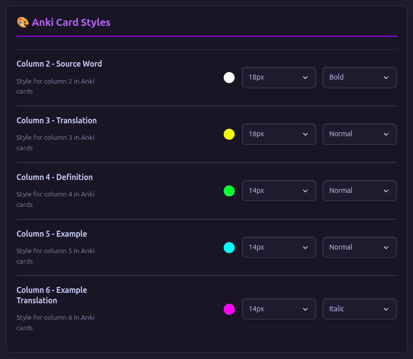

# 📚 Vocab AnkiSync AI Translate — Obsidian Plugin

<div align="center">


**AI-powered vocabulary synchronization between Obsidian and Anki with advanced translation support**

[Installation](#installation) • [Features](#features) • [Quick Start](#quick-start-guide) • [Configuration](#configuration-guide) • [Support](#support-community)

</div>

---

## 🌟 The Story Behind This Plugin
<a id="story-behind"></a>

"As a passionate language learner myself, I originally built this as a simple personal script to automate my vocabulary learning process. I focus on collecting the words I encounter in daily life that I don’t understand, and turning them into learning material. Like many of you, I struggled with manually creating flashcards and looking up translations while trying to learn new languages."

What started as a few lines of code running inside Obsidian has evolved into this comprehensive plugin. Seeing how much time it saved me in my English learning journey, I realized I could help fellow language enthusiasts who face the same challenges.

This plugin is my contribution to the language learning community — transforming the tedious process of flashcard creation into an efficient, intelligent system . From a personal tool to a community resource, it represents the power of shared knowledge and the joy of learning together.

— Yusuf Suleiman

---


## 🚀 Features
<a id="features"></a>

### 🤖 AI-Powered Translation
- **Advanced Groq AI Integration**
- **Context-Aware Translations** — Gets accurate translations with proper context and usage
- **Batch Processing** — Process multiple words simultaneously with intelligent rate limiting
- **Smart JSON Formatting** — Ensures consistent and parseable translation results

### 🎴 Anki Integration
- **Automatic Flashcard Creation** — Converts vocabulary tables directly to Anki cards
- **Custom Card Styling** — Fully customizable colors, fonts, and layouts for each column
- **Smart Sync** — Only updates changed cards
- **Custom Deck & Note Selection** — Choose your preferred deck and note type

### 🌍 Multi-Language Support
- **18 Languages** including English, Arabic, French, Spanish, German, Italian, Portuguese, Russian, Chinese, Japanese, Korean, and more
- **RTL Language Support** — Full support for Arabic, Hebrew, and Persian
- **Native Language Names** — Proper display of language names in their native scripts

### ⚡ Advanced Processing
- **Batch Management** — Process words in configurable batch sizes
- **Rate Limiting** — Intelligent API request management to respect service limits
- **Progress Tracking** — Detailed logging and progress updates
- **Error Handling** — Robust error recovery and retry mechanisms

---

## 📋 Prerequisites
<a id="prerequisites"></a>

### Required Software
- **Obsidian** v1.9.12 (The plugin was developed using version v1.9.12 and has not been tested on older versions.)
- **Anki (Desktop)** (Required for syncing vocabulary to your chosen deck. Since AnkiConnect is desktop-only, the sync feature is not available on mobile.)


### 📱 Platform Compatibility

| Platform | Anki Sync        | AI Processing   |
|----------|------------------|-----------------|
| Windows  | ✅ Works         | ✅ Works        |
| Linux    | ✅ Works         | ✅ Works        |
| macOS    | ⚠️ Not Tested    | ⚠️ Not Tested   |
| iOS      | ❌ No            | ⚠️ Not Tested   |
| Android  | ❌ No            | ✅ Works        |

**Note**: Mobile devices can process vocabulary but cannot sync to Anki due to AnkiConnect limitations.

---

## 🔗 AnkiConnect Setup
<a id="ankiconnect-setup"></a>

### Step 1: Install Anki
- Download Anki from the [official website](https://apps.ankiweb.net/)
- Install the software on your computer

### Step 2: Install AnkiConnect Add-on
1. Open Anki application
2. Go to **Tools** → **Add-ons** → **Get Add-ons**
3. Enter the code: `2055492159`
4. Click **OK** to install
5. **Restart Anki** to complete the installation

### Step 3: Configure AnkiConnect

#### Method 1: Complete Replacement (Recommended)
For New Users or Clean Setup:
1. Open Anki → Tools → Add-ons
2. Select AnkiConnect → Click Config
3. DELETE ALL existing content and replace with:

```json
{
    "apiKey": null,
    "apiLogPath": null,
    "ignoreOriginList": [],
    "webBindAddress": "127.0.0.1",
    "webBindPort": 8765,
    "webCorsOrigin": "http://localhost",
    "webCorsOriginList": [
        "http://localhost",
        "app://obsidian.md",
    ]
}
```

4. Click OK and Restart Anki

#### Method 2: Modify Existing Settings
If You Want to Keep Your Current Settings:
1. Open your current AnkiConnect configuration
2. Locate the "webCorsOriginList" section
3. Add this line to the array:
```json
"webCorsOriginList": [
    // ... your existing URLs ...,
    "app://obsidian.md",
]
```

---

## 🔧 Installation
<a id="installation"></a>

### Method: Manual Installation
1. Download the latest release from the [Releases Page](https://github.com/YusufSuleiman/vocab-ankisync-ai-translate/releases).  
2. Extract the contents of the ZIP file.  
3. Copy the extracted folder into your vault at:  
   `YourVault/.obsidian/plugins/`  
4. Open Obsidian → go to **Settings → Community Plugins** → enable *Vocab AnkiSync AI Translate*.  

---

## 🎯 Quick Start Guide
<a id="quick-start-guide"></a>

### Step 1: Initial Setup
1. Open Plugin Settings in Obsidian
2. Configure your preferences:
   - Set your vocabulary file path
   - Configure source and target languages

### Step 2: Create Your Vocabulary File
Create a markdown file with this table structure:

```markdown
# My Vocabulary List

| Number | Source Word | Translation | Definition | Example | Example Translation |
|--------|-------------|-------------|------------|---------|---------------------|
| 1      | hello       |             |            |         |                     |
| 2      | world       |             |            |         |                     |
| 3      | learn       |             |            |         |                     |
```

### Step 3: Process Your Vocabulary
1. Open Command Palette (`Ctrl/Cmd + P`)
2. Search for "**Professional Processing**"
3. Run the command and watch as AI processes your words

### Step 4: Sync with Anki
1. Ensure Anki is running with AnkiConnect
2. Run "**Sync Vocabulary with Anki**" command
3. Check your Anki deck for new flashcards!

---

## ⚙️ Configuration Guide
<a id="configuration-guide"></a>


### 🤖 Smart Processing


### 📁 File Settings


### 🌍 Language Settings


### 🤖 Professional Translation Settings


### ⚡ Advanced Settings


### 🎴 Anki Settings



### 🎮 Commands


---

## 🎮 Available Commands
<a id="available-commands"></a>

### 🔄 Advanced Processing
- **Professional Processing** — Main processing command using AI professional translation
- **Clear AI Memory** — Clears all cached AI responses immediately (in-memory + persisted)
- **Show Operation Summary** — Displays detailed summary of current/last operation

### 🔗 Anki Integration
- **Sync Vocabulary with Anki** — Syncs processed words to Anki

---

## ⚡ Advanced Configuration Options
<a id="advanced-configuration"></a>

The plugin includes over 20 advanced settings for power users and custom workflows:

### 🎯 Smart Auto Mode
- **Simplifies settings for regular users**
- **Ensures consistent experience and reasonable quality**
- **Manages complexity automatically in the background**
- **Balances quality vs performance**

### 🤖 AI Translation Engine
- **Consensus Translation** — Uses multiple AI models for critical translations
- **Learner Level** (A1-C2) — Adjusts complexity based on your proficiency level
- **Quality Threshold** — Sets minimum quality score for acceptable translations
- **Advanced Rate Limiting** — Fine-tune API request timing and limits

### 📚 Content Customization
- **Simplify Examples** — Automatically simplifies examples for beginners
- **Add Nuance** — Includes cultural context for advanced learners
- **Definition Length Control** — Limits definition length for better readability
- **Meanings Count** — Specify number of meanings to include per word

### 🌐 Network & Performance
- **Worker URL Management** — Configure multiple API endpoints for reliability
- **Auto Endpoint Switching** — Automatically switch to backup endpoints on failure
- **Update Notifications** — Get notified about new plugin versions
- **Custom Cache Settings** — Configure cache TTL and validation


---

## 🔍 Usage Examples
<a id="usage-examples"></a>

### 📝 Basic Vocabulary Processing
1. **Extract words** from your daily life learning activities
2. **Add to vocabulary table** with just source words
3. **Run Professional Processing** using AI translation
4. **Review and edit** generated content
5. **Sync to Anki** for spaced repetition
6. **Study regularly** with beautifully formatted cards

### 🌐 Language Pair Examples
- **English → Arabic** — Perfect for Arabic learners
- **Spanish → French** — Great for Romance language transitions
- **Japanese → English** — Excellent for kanji and vocabulary building
- **Any of 18 languages** — Flexible for any learning path

---

## 🛠️ Technical Details
<a id="technical-details"></a>

### 🤖 Current used AI Models
- **Kimi K2 Instruct**
- **Qwen 3 32B**
- **Llama 3.3 70B Versatile**
- **Llama 3.1 8B Instant**
- **OpenAI GPT-OSS 120B**
- **Llama 4 Maverick 17B**

### 🌐 How It Works
The plugin operates through a sophisticated **Cloudflare Worker** architecture that handles all AI communications:

#### **🔧 Cloudflare Worker Integration**
- **Secure Proxy** — The plugin connects to a dedicated Cloudflare Worker that acts as a secure intermediary
- **API Management** — The Worker manages all communications with Groq AI API using a free API key
- **Error Handling** — Provides robust error recovery and automatic failover between models

#### **🚀 Translation Process**
1. **Request Initiation** — Plugin sends vocabulary words to the Cloudflare Worker
2. **AI Processing** — Groq API processes the translation request with high-quality results
3. **Response Relay** — Worker returns the translated content back to the plugin

### ⚡ Rate Limits
- **Standard Models**: 30 requests per minute
- **High-Limit Models**: 60 requests per minute
- **Batch Processing**: 1-20 words per request
- **Auto-throttling**: Built-in rate limiting

### 🌍 Supported Languages
- 🇬🇧 English, 🇸🇦 Arabic, 🇫🇷 French, 🇪🇸 Spanish, 🇩🇪 German
- 🇮🇹 Italian, 🇵🇹 Portuguese, 🇷🇺 Russian, 🇳🇱 Dutch, 🇵🇱 Polish
- 🇨🇳 Chinese, 🇯🇵 Japanese, 🇰🇷 Korean, 🇮🇳 Hindi
- ℵ Hebrew, 🇮🇷 Persian, 🇹🇷 Turkish, 🇻🇦 Latin

---

## 🔄 Recent Updates

### 🚀 Version 1.0.0
- **Initial Release** - Core translation and sync functionality
- **18 Language Support** - Broad multilingual coverage
- **Smart Auto Mode** - Simplified user experience

---

## ❓ Troubleshooting
<a id="troubleshooting"></a>

### 🔧 Common Issues & Solutions

| Issue | Solution |
|-------|----------|
| **AnkiConnect Not Found** | Ensure Anki is running + AnkiConnect installed (code 2055492159) |
| **Processing Failures** | Check table format + Language settings |
| **Sync Issues** | Confirm deck and chosen Note type exists |

### 🚀 Performance Tips
- Use high-limit models for large vocabulary sets
- Adjust batch size based on your needs
- Enable rate limiting to avoid API errors
- Process in smaller batches for better error handling

---

## ❓ FAQ
<a id="faq"></a>

### 🤖 AI & Translation
**Q: How accurate are the translations?**
A: Very accurate for common vocabulary (~95%), but always review technical/specialized terms.

**Q: Can I use my own API key?**
A: I actually thought about that and even added the option at first, but then I realized people might suspect I’m stealing their keys, so I decided to remove it again

### 🔗 Anki Integration
**Q: Why can't I sync on mobile?**
A: AnkiConnect only works with Anki desktop app.

**Q: How often should I sync?**
A: After each vocabulary processing session, or whenever you add new words.

---

## 🤝 Contributing
<a id="contributing"></a>

We welcome contributions from the community! Whether you're a language learner, developer, or designer, there are many ways to help:

### 💡 How to Contribute
1. **Report Bugs** — Use GitHub Issues to report problems
2. **Suggest Features** — Share your ideas for improvements
3. **Documentation** — Improve guides and translations

---

## 💝 Support the Project
<a id="support-the-project"></a>

If this plugin has helped your language learning journey, consider supporting its development:

[](https://paypal.me/YusufSuleiman004)

Your support helps:
- 🚀 Add new features and improvements
- 🌍 Support more languages and models
- 🔧 Maintain and update the plugin
- 📚 Create better documentation and guides

---

## 📞 Support & Community
<a id="support-community"></a>

### ❓ Get Help
- **GitHub Issues**: [Report bugs or request features](https://github.com/YusufSuleiman/vocab-ankisync-ai-translate/issues)
- **Documentation**: Check this README and plugin settings
- **Community**: Share your experience with other users

### 🔗 Connect
- **Developer**: [Yusuf Suleiman](https://github.com/YusufSuleiman)
- **Repository**: [GitHub Project](https://github.com/YusufSuleiman/vocab-ankisync-ai-translate)
- **License**: GPLv3 — Free software: you can use, modify, and redistribute it, as long as you keep it open under the same license

---

<div align="center">

**Happy Language Learning! 🌍✨**

**Made with ❤️ for the language learning community**

[⭐ Star on GitHub](https://github.com/YusufSuleiman/vocab-ankisync-ai-translate) • [🐛 Report Issue](https://github.com/YusufSuleiman/vocab-ankisync-ai-translate/issues) • [💡 Request Feature](https://github.com/YusufSuleiman/vocab-ankisync-ai-translate/discussions)

</div>

